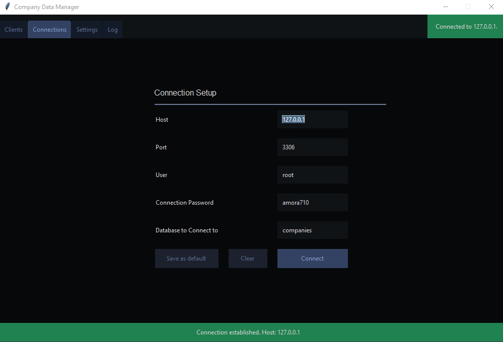
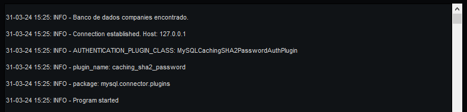

# Client Manager

## Description
A small (unfinished) client managing project based on MySQL and Python (3.0+). Uses the MySQL Python Connector package. The GUI was built using Tkinter.

## Running

Firstly, a MySQL connection is needed. [MySQL Workbench](https://dev.mysql.com/downloads/workbench/) is suggested.

After setting up a connection, you can connect the *main.py* program to some specified database (see example below). Note that, if the database does not exist in the connection, one will be created using the given name.

For troubleshooting, you can check the log. This is what a healthy connection would look like, for example:

## Remarks

This is an unfinished project, which was created for learning purposes.

